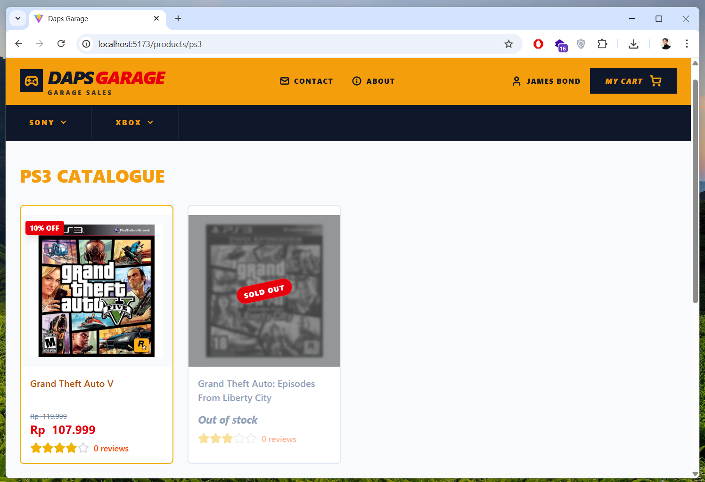

# DapsGarage E-Commerce

> [!IMPORTANT]
> This project is still **under development** and is intended for **learning purposes**.

A modern e-commerce platform built with React, Node.js, and Supabase.


## 🚀 Project Overview

DapsGarage is a full-stack e-commerce application designed for a premium shopping experience. It features a responsive frontend, a robust backend API, and a real-time database with Supabase.

### 🛡️ Backend
The backend is a Node.js server using Express to handle API requests and interact with Supabase.
- **Framework**: [Express.js](https://expressjs.com/)
- **Database**: [Supabase](https://supabase.com/) (PostgreSQL)
- **Authentication**: JWT (JSON Web Tokens)
- **Security**: Bcrypt for password hashing
- **Middleware**: Custom authentication middleware for protected routes

### 🎨 Frontend
The frontend is a fast, modern web application built with React and Vite.
- **Framework**: [React](https://react.dev/)
- **Build Tool**: [Vite](https://vitejs.dev/)
- **Styling**: [Tailwind CSS](https://tailwindcss.com/)
- **Icons**: [Lucide React](https://lucide.dev/)
- **API Client**: [Axios](https://axios-http.com/)
- **Routing**: [React Router](https://reactrouter.com/)

---

## 🛠️ MVP Functionality

The current version of the application (MVP) includes:
- **Authentication**: User registration and login with secure password storage.
- **Platform Discovery**: Browse products categorized by gaming platforms (e.g., PC, PlayStation, Xbox).
- **Product Management**: Dynamic product listing with stock status and discounts.
- **Cart System**: Authenticated users can add products to their cart, view cart items, and remove items.
- **Responsive Design**: Fully optimized for various screen sizes.

---

## ⚙️ Setup Instructions

### 1. Supabase Setup
You need a Supabase project with the following tables:
```
coming soon
```

### 2. Environment Variables
Create a `.env` file in the `backend` directory based on `env.template`:
```env
PORT=9999
SUPABASE_URL=your_supabase_url
SUPABASE_KEY=your_supabase_anon_key
JWT_SECRET="your_jwt_secret_key"
```

### 3. Local Development

#### Backend
```bash
cd backend
npm install
npm run dev
```

#### Frontend
```bash
cd frontend
npm install
npm run dev
```

The frontend will usually run on [http://localhost:5173](http://localhost:5173) and the backend on [http://localhost:9999](http://localhost:9999).
